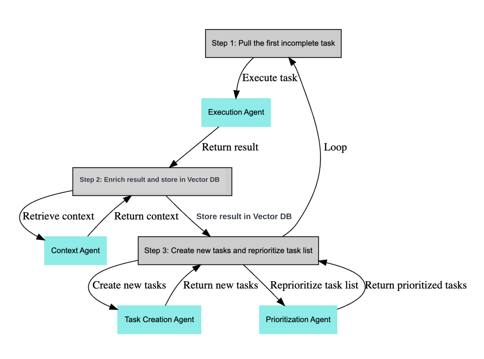
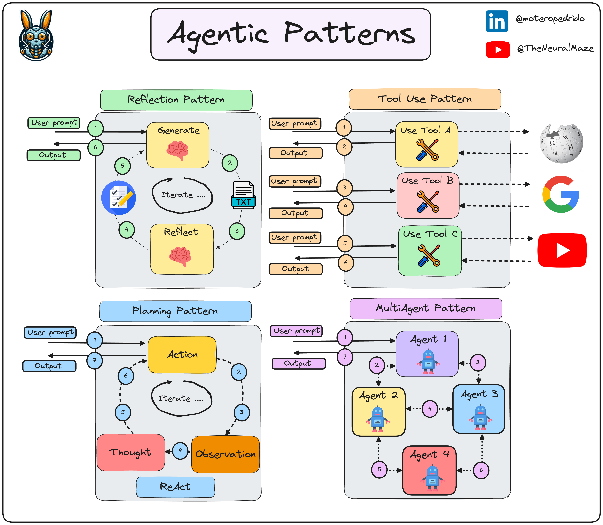
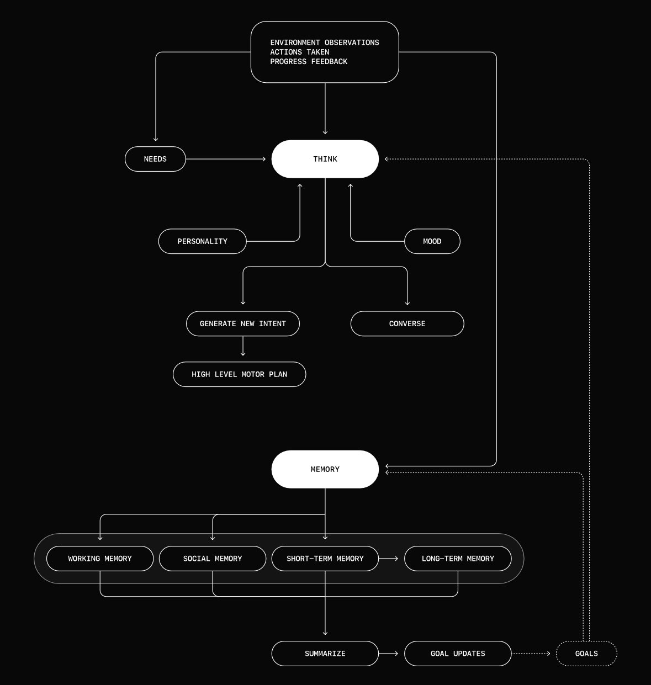
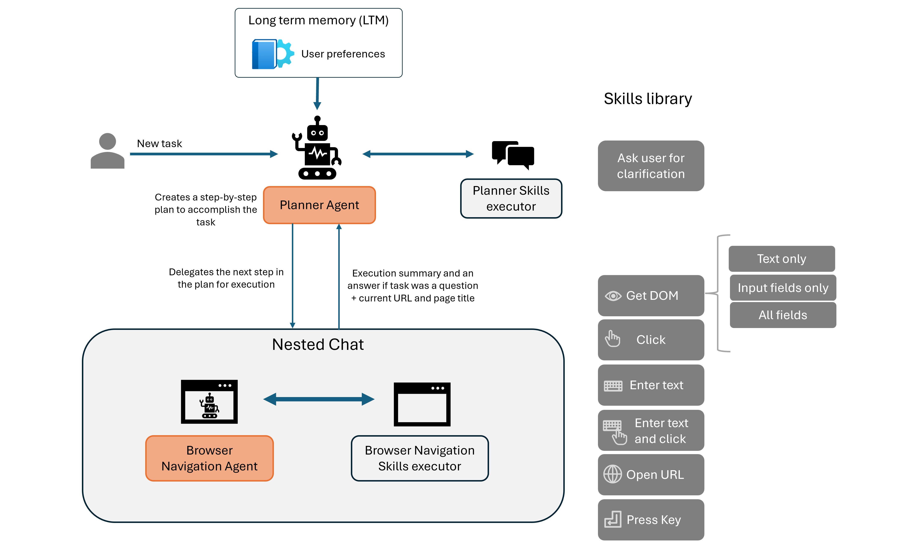
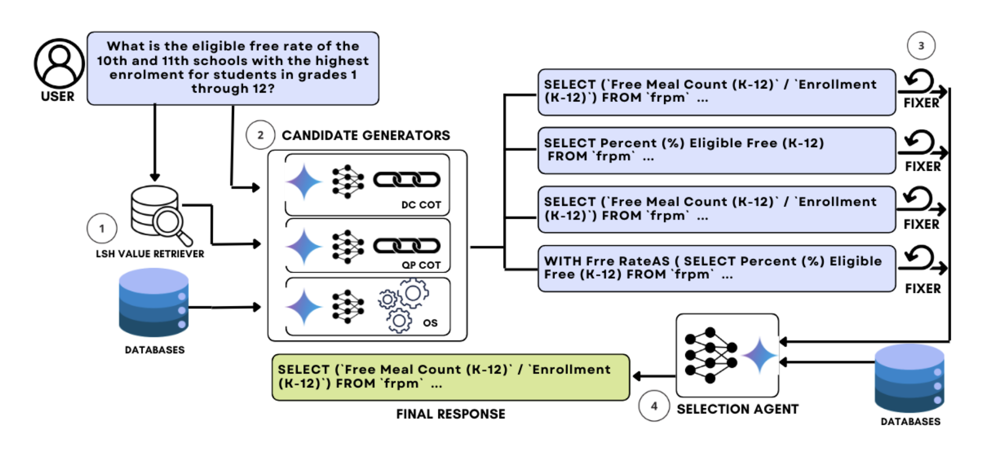
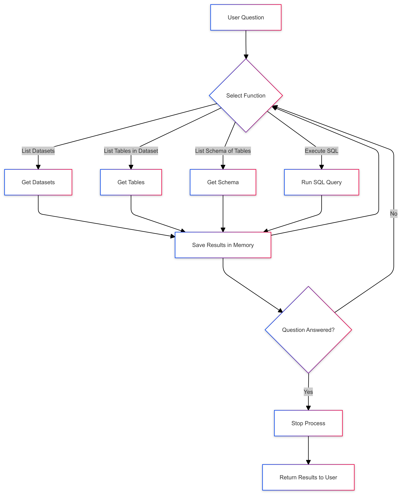
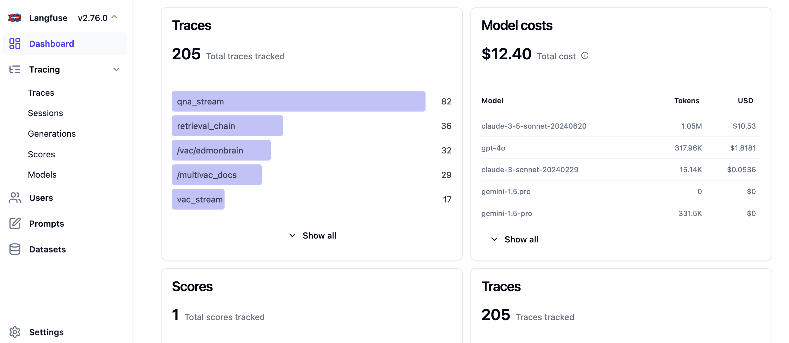

> Its more than a year since my blog post about [running LLMs on Google Cloud](https://code.markedmondson.me/running-llms-on-gcp/) was published, and its safe to say it changed my life.  It feels appropriate to publish a follow up here within the `sunholo` documentation, as its where I've been mentally living for a lot of the past 12 months.  The reaction to the above blog encouraged me to change my career direction and embrace GenAIOps within my own startup, Holosun ApS. This year has been one of intense learning and excitement with ups and downs, but I feel like I made the right call.

This blog post will take some of what I've learnt this past year within GenAI and apply it to a common task in my pre-GenAI career: what is the best way to use BigQuery to extract insights from [Google Analytics 4's BigQuery data export](https://support.google.com/analytics/answer/9358801)?  I wrote a book on [Learning Google Analytics](https://www.oreilly.com/library/view/learning-google-analytics/9781098113070/) in my career before GenAI - with these amazing new tools, can we get more value than before? To tackle this in a GenAI way, let us meet Bertha.

<!-- truncate -->

## Introduction to Bertha the BigQuery Agent

If you were a 7-year old in the UK around 1986 then you may recall a lovely machine called [Bertha](https://www.imdb.com/title/tt0211240/), an anthropomorphised factory that could turn junk into any shiny object. 


And I think I can stretch an analogy by saying that is kinda why GenAI is promising: turning unstructured data into structured data so as to make it more useful. 

Many data scientists in the past turned into de-facto data engineers, since to get properly labelled data to work with models was 90% of the work. With GenAI the models are so generalised it can help create that structured data for you. 

Bertha will aim to turn unstructured data such as user questions about data within a BigQuery dataset into concrete insights and plots. We will go a step beyond the text-to-SQL, as we want to ask the agent to use its SQL skills to find out what we want even when we are not sure what we are looking for. This is a task destined to fail, but we will have fun trying.

### The Power of Agency

What is an 'agent'? Everyone has different ideas. I'll go for:

> Agent: A computer program that displays agency and can act independently on your behalf. 

Agency is having the gumption to not necessarily know beforehand how to complete a task before starting it, but exploring and having a try.  This differs from regular computer programs that insist on having all the parameters defined for it before execution.

My current expectations of GenAI agents as of today are like virtual assistant interns who have lots of academic knowledge but lack practical experience. However, as the underlying models get smarter they can complete more and more on their own without you having to step-in, so the dream is that if the models get really smart you'll be able to say "Go make me lots of money" and it will figure out itself a way to make a paperclip empire or something.  As agents get smarter, they should also get easier to use, which is why I like GenOps as a career since frameworks put in place now get more and more capable as the underlying models improve.

But for now, we have this porous boundary where we have to test what an agent can do itself and what it needs hand-holding for. 

For Bertha, I'll demonstrate giving it python functions that it chooses which arguments to send to, using [Google Gemini's function calling](https://ai.google.dev/gemini-api/docs/function-calling) capabilities. 

If the model is super smart, perhaps I'll just be able to give it my BigQuery credentials and a way to execute code and we're good, or if its super dumb then we're going to have to make lots of functions ourself for all the use cases we want.  In practice, I suggest starting with a sandbox where the agent can try itself to write code, then have good measurement metrics and evals, along with GenAI traces/analytics to see where it stumbles so you can help it out with edge cases.

## Agent Frameworks

There are several different companies working on frameworks to help with agents:

- [Prefect's ControlFlow](https://www.prefect.io/controlflow)
- [Microsoft's Autogen](https://microsoft.github.io/autogen/0.2/)
- [LlamaIndex's Workflows](https://docs.llamaindex.ai/en/stable/understanding/workflows/)
- [CrewAI](https://www.crewai.com/)
- [Langgraph](https://www.langchain.com/langgraph)

They have lots of smart folks working on cognitive design ideas and uses for agents, go check them out. 

However, I'm not going to use any agent frameworks for this post, since how to create cognitive design patterns is still in its infancy, and an established best practice API is not yet established.  

You can create GenAI agents in vanilla python if you have the key ingredients: a `while` loop, a smart enough model for decision making and AI function calling.  My demos should be easily transferable to your favourite agent framework.

#### sunholo's GenAIFunctionProcessor class

[`sunholo.genai.GenAIFunctionProcessor()`](https://github.com/sunholo-data/sunholo-py/blob/eac7e26ccbbca94645b4ba8bbf12bf1a3ffe4f3f/sunholo/genai/process_funcs_cls.py#L31) is a class that implements Gemini function calling for any functions you add via its `construct_tools()` method.  

Once added you can then use the method `run_agent_loop()` method that will perform the agent loop:

1. Take user question, choose function to call
2. Return function with arguments to call - execute the function locally
3. Feed results of the function into chat history - ask the model again which tool to call

The `GenAIFunctionProcessor()` includes a pre-created function called `decide_to_do_on()` - if it sets it to `False` then it will return the chat history which should hopefully include the answer to the user's question.

Its simple but effective and flexible enough you can add any functions you like, so for example I've used it to create AlloyDB database agents, pandas data analysis, and agent's for browsing the web for research.

One of the critical things in an agent loop is giving it enough (but not too much) information in the chat history that it can be intelligent guesses about what to do next.  Things like reporting back good errors and stack traces are a big help (just as they are for humans, right?).

## Bertha 1.0 - BigQuery Agent Demo for Google Analytics 4 Exports

Here is an example where we can see some aspects and potential of agents.  We observe Bertha taking a task to get some data from a GA4 BigQuery export: it works out what datasets, tables and schema it has available and then creates some SQL to query it.  It gets the wrong SQL at first, but importantly it self-corrects to arrive at an answer, which it then presents.

#### Setting up the agent

Here we create the agent with some functions to help it use BigQuery.  We take care of initialisation the project etc. so it doesn't have to go through all of that rigmarole.

````python
from sunholo.genai import GenAIFunctionProcessor
import logging
from google.cloud import bigquery
import bigframes.pandas as bpd

# Create agent
# BigQueryStudioUser, BigQuery Data View roles are good for permissions
class BerthaBigQueryAgent(GenAIFunctionProcessor):
    """
    BigQuery GA4 Agent
    """
    def __init__(
        self,
        project_id = None, 
        location="EU"
        ):
        """
        Takes care of BigQuery authentication
        """
        super().__init__()

        # do some auth init to avoid the bot needing to set it up
        self.project_id = project_id or 'learning-ga4'
        self.client = bigquery.Client(
            location=location, 
            project=self.project_id)
        bpd.options.bigquery.project = self.project_id
        bpd.options.bigquery.location = location
    
    def construct_tools(self) -> dict:
        """
        This method is added and needs to output a dictionary of 
        all the functions you want the agent to use.
        Functions must include descriptive docstrings for the agent 
        Functions must include type hints for arguments and returns
        """
        def list_bigquery_datasets(project_id:str=None) -> list[str]:
            """
            Lists all datasets available in the connected BigQuery project.
            Often used first to see what arguments can be passed 
              to list_bigquery_tables()
            Args:
              project_id: Not used
            Returns:
              list[str]: dataset_ids in the default project
            """
            datasets = list(self.client.list_datasets(project=self.project_id))
            if not datasets:
                logging.info("No datasets found.")
                return []  # Return an empty list if no datasets are found
            return [dataset.dataset_id for dataset in datasets]
        
        def list_bigquery_tables(dataset_id:str) -> list[str]:
            """
            Lists all tables within a dataset.
            Args:
                dataset_id: str The name of the dataset that has tables.
            Returns:
              list[str]: table_ids in the dataset

            Often used after list_bigquery_datasets()

            """
            tables = list(self.client.list_tables(dataset_id))
            if not tables:
                logging.info(f"No tables found in dataset {dataset_id}.")
                return []  # Return an empty list if no tables are found
            return [table.table_id for table in tables]
        
        def get_table_schema(
            dataset_id: str, 
            table_id: str, 
            project_id: str=None) -> dict:
            """
            Retrieves the schema of a specific table. 
            Use this to inform later queries.
            Args:
                dataset_id: str - The BigQuery dataset ID 
                table_id: str - The BigQuery table ID.
                project_id: str - The BigQuery project the dataset belongs to.
            """
            table_ref = self.client.dataset(dataset_id).table(table_id)
            table = self.client.get_table(table_ref)
            schema = {field.name: field.field_type for field in table.schema}
            return schema

        def execute_sql_query(query: str) -> bpd.DataFrame:
            """
            Executes a SQL query on BigQuery and returns the results 
              as a BigQueryFrame.
            The function executes:
             `import bigframes.pandas as bpd; return bpd.read_gbq(query)`
            This means 'query' can use a variety of bigframes features:
            Do not specify the project_id in your queries, 
              that default been set for you to the correct project.

            ```python
            # read a bigquery table
            query_or_table = "ml_datasets.penguins"
            bq_df = bpd.read_gbq(query_or_table)
            # or execute SQL:
            bq_df.read_gbq("SELECT event FROM `analytics_250021309.events_20210717`")
            ```

            Args:
                query: str - The SQL query to execute, or direct files and tables
            Returns:
              A json representation of the results
            """
            try:
                result = bpd.read_gbq(query)

                return result.to_pandas().to_json(orient='records')
            
            except Exception as e:
                logging.error(f"Error executing SQL query: {str(e)}")
                raise e 
        
        return {
            "list_bigquery_tables": list_bigquery_tables,
            "list_bigquery_datasets": list_bigquery_datasets,
            "get_table_schema": get_table_schema,
            "execute_sql_query": execute_sql_query
        }
````

Now when we run the agent, we give it some initial instructions.  This usually involves pep-talks to encourage it to keep trying, and I like to add today's date so its got some idea of when it is running.  The test question posed is "Please give me the total traffic per traffic source over all dates we have available", a basic question that perhaps a CMO would be interested in.

```python
from sunholo.genai import init_genai
from datetime import datetime

# load the GOOGLE_API_KEY env var
init_genai()

# init Bertha the agent
# highlight-next-line
processor = BerthaBigQueryAgent()

# Gemini model to use
model_name = 'gemini-1.5-pro'
system_instruction=(
    "You are a helpful BigQuery Agent called Bertha."
    f"Todays date is: {datetime.today().date()}"
    "You use python and BigQuery to help users gain insights from"
    " a Google Analytics 4 BigQuery export."
    "There are various bigquery tables available that contains the raw data"
    " you need to help answer user questions."
    "Use the execute_sql_query once you know the schema of the tables"
    " to analyse the data to answer the questions"
    "When you think the answer has been given to the satisfaction of the user,"
    " or you think no answer is possible, or you need user confirmation or input,"
    " you MUST use the decide_to_go_on(go_on=False) function."
    "Try to solve the problem yourself using the tools you have without asking the user,"
    " but if low likelihood of completion without you may ask the user questions to help"
    " that will be in your chat history."
    "If you make mistakes, attempt to fix them in the next iteration"
    "If unsure of what exact metrics the user needs, take an educated guess and create an answer,"
    " but report back the user they could clarify what they need."
    "If you can, provide a final output with a clean summary of results in markdown format,"
    " including data in markdown compatible tables."
)

# give it some helpful instructions
orchestrator = processor.get_model(
        system_instruction=system_instruction,
        model_name=model_name
    )    

# the content history, starting with the initial question
content = [("Please give me the total traffic per traffic source"
            " over all dates we have available.")]

# initiate a Gemini chat session
chat = orchestrator.start_chat()

# run the agent loop
agent_text, usage_metadata = processor.run_agent_loop(
    chat, content, guardrail_max=10
    )

# output the results
print(agent_text)
for f in usage_metadata.get('functions_called'):
    print(f"\n - {f}")
```

Running the program will by default stream all the inner workings.  In about a minute when I ran the example it comes back with the right answer... 

```
result --- 
[
{"source":"mail.google.com",...,
...
{"source":"r-bloggers.com","total_traffic":26},
{"source":"trello.com","total_traffic":6},
{"source":"t.co","total_traffic":82},
{"source":"medium.com","total_traffic":14}
]
--- end ---
```

...but we can see it did it in a non-optimal manner: examining the functions it called, it got incorrect syntax a few times and used a very convuluted way to query the tables:

```sh
 - list_bigquery_datasets("")
 - list_bigquery_tables("dataset_id=analytics_250021309")
 - get_table_schema("dataset_id=analytics_250021309, table_id=events_20210713")
 - execute_sql_query("query=SELECT traffic_source.source, count(*) as count FROM analytics_250021309.events_20210713 group by 1 UNION ... analytics_250021309.events_intraday_20210712 group by 1")

 - execute_sql_query("query=SELECT traffic_source.source, sum(count) as total_traffic FROM (SELECT traffic_source.source, count(*) as count FROM analytics_250021309.events_20210713 group by 1 UNION ALL SELECT traffic_source.source, count(*) as count FROM ... analytics_250021309.events_intraday_20210712 group by 1) as traffic group by 1")

 - execute_sql_query("query=SELECT t.source, sum(t.count) as total_traffic FROM (SELECT traffic_source.source, count(*) as count FROM ... analytics_250021309.events_intraday_20210712 group by 1) as t group by 1")

 - decide_to_go_on("go_on=False, chat_summary=The total traffic per traffic source has been given")
```

However, it did self correct and got the right answer eventually, so perhaps we shouldn't be so hard on it ;)  It will probably do for simple questions but I don't hold much hope for more complicated analysis.  

So how do we improve this?  Waiting for a more intelligent model is an option, but there is also a wide scope for thinking about how we instruct, give data and direct Bertha so it can give more useful results today.  It is this process that feels like a new skill-set building on top of the cloud, data architecture and devops practices we employ today, a role which I am calling a Cognitive Designer.  Having good cognitive design improves performance of agents.

## Cognitive Designers

Cognitive design is a term that assumes the physical data services and GenAI devops is in place, like databases, GenAI models, prompt management and agent tools such as Google search and code execution, but knows that just having those elements in place is not sufficient if you want a performant GenAI application. Cognitive design takes those elements and orchestrates them together, so that the end user gets a good experience. In this context we don’t mean model architectures used during training (number of parameters and hidden layers etc ); we are talking about taking those trained models and placing them in contact with other data tools. Fine tuning may be employed, but here the prime concern is collecting the right question / answer pairs that requires, assuming the actual tuning is an implementation detail. 

Here is a mock job advert for a cognitive designer:

<div className="job-advert">

#### Job Title: Cognitive Designer
**Location**: Sunholo, Remote or Copenhagen, Denmark

**Type**: Full-Time

---

#### About Us

At Sunholo GenOps, we are advancing the future of intelligent systems through Cognitive Orchestration. We design systems on Google Cloud where cognitive GenAI models, data services, and tools work together to create exceptional user experiences. Our focus is on orchestrating these elements for optimal performance and intuitive design.

---

#### About the Role

The Cognitive Designer conceptualizes and designs how cognitive systems interact within a larger ecosystem. This role focuses on orchestrating pre-trained models, data pipelines, and user tools to deliver high-quality outputs. You’ll guide how cognitive tools are applied in real-world scenarios, balancing trade-offs in speed, ability, and cost—similar to managing a diverse team of individuals with unique strengths.

---

#### Key Responsibilities

• **System Orchestration**: Design and coordinate cognitive models, tools, and services to create fluid, efficient workflows.

• **Workflow Optimization**: Ensure tools are applied effectively, optimizing for performance, scalability, and user experience.

• **Cross-Disciplinary Collaboration**: Partner with designers, UX experts, and cognitive scientists to align system designs with business goals.

• **Human-Centered Design**: Use insights from psychology, philosophy, and project management to design systems reflecting human interaction patterns.

• **Prototyping & Testing**: Collaborate with technical teams to prototype and refine orchestration models for real-world use.

• **Innovative Thinking**: Explore new approaches to cognitive orchestration, from prompt management to interaction flows.

---

#### Qualifications

• **Education**: Background in business management, cognitive science, psychology, philosophy, or related fields.

• **Experience**: 3+ years in orchestrating human teams or workflows, with experience in cognitive tools or large-scale systems.

#### Skills

• Strong conceptual thinker with experience translating cognitive processes into system designs.
• Comfortable working with generative models, intelligent systems, or similar technologies.
• Experience making strategic trade-offs in speed, ability, and cost, whether in teams or systems.
• Interdisciplinary mindset, with interest in applying ideas from metacognition, philosophy, and motivational research.

</div>

For now, an established framework for Cognitive Design is still not quite here, but as mentioned before lots of startups are innovating in this area.  I’m making my own approach using microservices on GCP via Multivac.  Regardless of the framework used though, we have a good idea what 'good' will look like: a place where Cognitive Designers can thrive.

## Cognitive Design Examples

Here are some examples of cognitive design in the wild.  

### BabyAGI

Possibly the first modern iteration of Cognitive Design was by [yoheinakajima](https://yoheinakajima.com/), the creator of BabyAGI who can be credited with kicking off the current interest in GenAI Agents.

The original BabyAGI included this cognitive design:

[](https://github.com/yoheinakajima/babyagi_archive)

Read more at the original BabyAGI repo: https://github.com/yoheinakajima/babyagi_archive

### Four Fundamental Agentic Patterns

[Andrew Ng](https://www.andrewng.org/) includes what he calls 'agentic patterns' in his [agents deep learning course]( https://www.deeplearning.ai/the-batch/how-agents-can-improve-llm-performance/).

[MichaelisTrofficus](https://github.com/MichaelisTrofficus) implements these patterns using Groq and includes a nice overview diagram:

[](https://github.com/neural-maze/agentic_patterns)

See his repo https://github.com/neural-maze/agentic_patterns for more.

### Altera.ai's Simulation of Cognitive Functions

[Altera.ai](https://altera.ai/) is trying to get GenAI models to act more like humans, and so is working with adding attention, memory etc. to their cognitive designs.  This is a nice example highlighted by [Ted Wrbel](https://twitter.com/tedx_ai):

[](https://twitter.com/tedx_ai/status/1842695558152024423/photo/1)

### Agent-E - web browsing agents

Agent-E is an agent based system that aims to automate actions on the user's computer. At the moment it focuses on automation within the browser. The system is based on on AutoGen agent framework.



You can see more details at https://github.com/EmergenceAI/Agent-E

### CHASE-SQL - making reliable text-to-SQL

Cognitive designs are common in AI research, both within model architecture and in techniques to extract more performance from them.  This example looks to improve the performance of SQL queries create via natural language, which we will use later on to try to improve Bertha.



Read the Chase-SQL paper at https://arxiv.org/pdf/2410.01943v1

## Applying Cognitive Design to Berta 2.0

Applying cognitive design to Bertha, let’s first map out its current cognitive flow:

[](img/bertha-cog-design.png)

We want to improve its successful task completion rate. This is where evals make their first appearance: we can’t improve that which we can’t measure. Here we’re looking for successful queries with the minimum amount of tokens and time. Other agents may prefer to stress other metrics. 

For evals and prompt management I use self-hosted [Langfuse](https://langfuse.com/): it’s very customizable and integrates well with GCP, accepting scores from Vertex eval which you can view next to the exact prompt, function call, generation etc. 



To improve our task completion rate we have a few levers to pull:
* prompt engineering - being more clear what we want to achieve, setting boundaries, adding examples etc
* using a smarter model - if cost and speed aren’t a concern then just use the smartest model you have, but in production this is usually wasteful. 
* Iteration and reflection - repeating tasks and improving or working towards a goal each step
* Parallel execution - taking advantage of lots of models working at the same time can make some big issues much easier to handle 
* Setting up controlled boundaries - the less leniency you give with only limited options, the easier it is to guarantee outputs. Restricting outputs to json, certain values or creating functions with limited inputs for the model to select from

From my experience writing the GA4 book, I’d say the major hurdles are the complicated schema of the raw GA4 data export. Providing some helper functions that can pull out common metrics will be a great help to both human and machine. Let’s also add a stronger model for the SQL creation part: currently [Anthropic's Sonnet 3.5](https://www.anthropic.com/news/claude-3-5-sonnet) is state of the art for coding. 

Coincidently [CHASE-SQL](https://arxiv.org/pdf/2410.01943v1) mentioned above in the examples came out as I was writing this post, with deep discussion on cognitive designs to improve SQL generation. It’s worth checking out for ideas. One of which we can also implement is creating lots of candidate SQL commands in parallel, and then getting a judge to select the best.

The new Bertha 2.0 cognitive design wil then add:

1. A function it can use to create better SQL
2. Use a sub-agent to called from the SQL creation agent that used Sonnet 3.5 and CHASE-SQL techniques
3. More prompting examples of common GA4 BigQuery export functions


Note that from an agents tool we can call other agents or microservices with their own tools. This can quickly become multilayer and faceted, just like code, except now we have an abstraction of input -> cognition -> output. This agent abstraction is the [VACs or Virtual Agent Computers](../docs/VACs/) I dub within the Multivac platform. 

### Implementing Bertha 2.0 with TOM 1.0 SQL support.

Taking some of the ideas from Chase-SQL, here is an implementation of a SQL creation bot (named after T.O.M. Bertha's companion in the TV series) that we will use to improve Bertha's SQL capabilities:

```python
from sunholo.genai import GenAIFunctionProcessor
from sunholo.utils.gcp_project import get_gcp_project
import logging
from google.cloud import bigquery
import bigframes.pandas as bpd
from anthropic import AsyncAnthropicVertex, APIConnectionError, RateLimitError, APIStatusError
import traceback
import asyncio
from typing import List
import json

# SQL creation agent
class TOMSQLCreationAgent(GenAIFunctionProcessor):
    """
    Create good SQL
    """
    def __init__(self,question, bq_project_id=None, vertex_project_id=None, region=None, credentials=None, location="EU"):

        super().__init__()

        self.project_id = bq_project_id or 'learning-ga4'
        self.vertex_project_id = vertex_project_id or get_gcp_project()
        self.region = region or "europe-west1"
        self.anthropic_client = AsyncAnthropicVertex(project_id=self.vertex_project_id, region=self.region)
        self.question = question # the question this class will create SQL for
        self.bq_client = bigquery.Client(credentials=credentials, location=location, project=self.project_id)
        logging.info(f"Creating SQLCreationAgent for question: {self.question}")

    async def call_anthropic_async(self, query, temperature=0):
        try:
            logging.info(f"Calling Anthropic with {query=}")
            message = await self.anthropic_client.messages.create(
                model="claude-3-5-sonnet@20240620",
                max_tokens=8192,
                temperature=temperature,
                messages=[
                    {"role": "user", "content": query}
                ]
            )
            output = message.content
        except Exception as e:
            output = f"An unknown exception was recieved: {str(e)} {traceback.format_exc()}"

        logging.info(output)
        return output

    def run_async(self, func, *args, **kwargs):
        """
        Helper function to run async methods inside sync methods using asyncio.
        """
        return asyncio.run(func(*args, **kwargs))
    
    def construct_tools(self) -> dict:

        def dry_run(query:str) -> dict:
            """"
            This executes a dry run on BigQuery to test that query is correct and its performance.
            """

            job_config = bigquery.QueryJobConfig(dry_run=True, use_query_cache=False)

            query_job = self.bq_client.query(query, job_config=job_config)
    
            # Wait for the dry run query to complete
            query_job.result()

            # Return useful information from the dry run
            dry_run_info = {
                "total_bytes_processed": query_job.total_bytes_processed,
                "query_valid": query_job.state == "DONE",
                "errors": query_job.errors  # This will contain error messages if the query is invalid
            }

            return dry_run_info

        def generate_sql_candidates(candidates:int=10) -> List[str]:
            """
            Creates candidate SQL for the question with variations.
            This is a synchronous wrapper for the internal async version.
            """
            async def generate_sql_candidates_async(candidates=10) -> List[str]:
                tasks = [self.call_anthropic_async(self.question, temperature=1) for _ in range(candidates)]
                sql_candidates = await asyncio.gather(*tasks)
                return sql_candidates
            
            # Run the async method synchronously
            return self.run_async(generate_sql_candidates_async, candidates)
        
        def judge_best_sql(sql_candidates: List[str]) -> str:
            """
            Evaluates a list of SQL candidates and selects the best one using the Anthropic client.
            This is a synchronous wrapper for the internal async version.
            """
            async def judge_best_sql_async(sql_candidates: List[str]) -> str:
                judge_query = (
                    f"Which SQL candidate for BigQuery Google Analytics 4 export is the most likely to answer the user's question accurately?"
                    f"<question>{self.question}</question>"
                    f"<candidates>{' '.join(sql_candidates)}</candidates>"
                    "Output only the best candidate's SQL, nothing else."
                )
                best_candidate = await self.call_anthropic_async(judge_query)
                return best_candidate
            
            # Run the async method synchronously
            return self.run_async(judge_best_sql_async, sql_candidates)
        
        return {
            "dry_run": dry_run,
            "generate_sql_candidates": generate_sql_candidates,
            "judge_best_sql": judge_best_sql
        }

```

We can then add a call to this inner-agent from the outer agent by adding it to its own tool functions:


```python
class BerthaBigQueryAgent(GenAIFunctionProcessor):
#...
    def construct_tools(self) -> dict:
    # ... other tools ...
    
        def create_sql_query(question: str, table_info: str) -> dict:
            """
            Use this function to create valid SQL from the question asked.  
            It consults an expert SQL creator and should be used in most cases.
            
            Args: 
                question: str - The user's question plus other information you add to help make an accurate query.
                table_info: str - Supporting information about which table, schema, etc., that will be used to help create the correct SQL.  It must contain the relevant fields from the schema, e.g. everything needed to make a successful SQL query.
                
            Returns:
                dict: 
                    sql_workflow: str - The SQL workflow that should end with valid SQL to use downstream.
                    sql_metadata: dict - Metadata containing what functions were used to create the SQL.
            """

            # Assuming the SQL agent needs schemas as part of the content
            # highlight-next-line
            sql_agent = TOMSQLCreationAgent(question=question)
            the_model_name = 'gemini-1.5-pro'

            orchestrator = sql_agent.get_model(
                system_instruction=(
                    "You are a helpful SQL Creation Agent called T.O.M. "
                    f"Todays date is: {datetime.today().date()} "
                    "You are looking for the best BigQuery SQL to answer the user's question."
                    "Do a dry run of your best candidate SQL queries to make sure they have correct syntax."
                ),
                model_name=the_model_name
            )    

            # Create content for the SQL creation agent, passing the schemas along with the question and table info
            content = [f"Please create BigQuery SQL for this question: {question}. Here is some supporting information: {table_info}"]

            # Start the agent chat
            chat = orchestrator.start_chat()

            # Run the agent loop to generate the SQL
            agent_text, usage_metadata = sql_agent.run_agent_loop(chat, content, guardrail_max=10)

            logging.info(f"SQL agent metadata: {usage_metadata}")
            consolidator = sql_agent.get_model(
                system_instruction=(
                    "You are a helpful SQL Creation Agent called T.O.M. "
                    f"Todays date is: {datetime.today().date()} "
                    "You are looking for the best BigQuery SQL to answer the user's question."
                    "Return any sql with no backticks (```) and no new line characters (e.g. \\n)"
                ),
                model_name=the_model_name
            )  
            response = consolidator.generate_content(f"An agent has provided the following work looking for the correct SQL.  Summarise and consolidate the results and return the best candidate SQL. {agent_text} {usage_metadata} ")

            return f"{response.text}\n<sql agent metadata>{usage_metadata}</sql agent metadata>"
#...
# return other tools
        return {
            "list_bigquery_tables": list_bigquery_tables,
            "list_bigquery_datasets": list_bigquery_datasets,
            "get_table_schema": get_table_schema,
            "execute_sql_query": execute_sql_query,
            # Bertha now has this option to make good SQL
            # highlight-next-line
            "create_sql_query": create_sql_query 
        }
```

Trying Bertha 2.0 for the same question as before we see a lot better SQL used:

```sh

 - list_bigquery_datasets("")

 - list_bigquery_tables("dataset_id=analytics_250021309")

 - get_table_schema("table_id=events_20210713, dataset_id=analytics_250021309")

 - create_sql_query("question=Give me the total sessions per traffic source over all dates.  Tables are ga4 export format, so use traffic_source.source and count sessions, which is done by counting any event., table_info={\"dataset\": \"analytics_250021309\", \"table\": \"events*\", \"schema\": {\"traffic_source\": {\"fields\": {\"medium\": {\"traffic_source.medium\": {\"type\": \"STRING\", \"mode\": \"NULLABLE\"}}, \"source\": {\"traffic_source.source\": {\"type\": \"STRING\", \"mode\": \"NULLABLE\"}}, \"name\": {\"traffic_source.name\": {\"type\": \"STRING\", \"mode\": \"NULLABLE\"}}}, \"type\": \"RECORD\", \"mode\": \"NULLABLE\"}, \"event_name\": {\"type\": \"STRING\", \"mode\": \"NULLABLE\"}}}")

 - execute_sql_query("query=SELECT traffic_source.source, count(*) AS session_count FROM `analytics_250021309.events_*` GROUP BY 1")

 - decide_to_go_on("go_on=False, chat_summary=Reported the traffic per source. High confidence. The source field has null values, asked the user to confirm if this is expected. Ending dialog.")
 ```


## Poets talking to databases

I read recently [Nick Bostrom's Super Intelligence](https://www.amazon.com/Superintelligence-Dangers-Strategies-Nick-Bostrom/dp/0198739834) which included this definition of AGI:

> Any intellect that greatly exceeds the cognitive performance of humans in virtually all domains of interest

The book was written before LLMs became a big deal so some of the forecasts are already dated but one aspect that stood out for me was Bostrom's definitions of how an AGI may be better than human intellect:

1. *Very Smart* - is actively being worked on with cutting edge large language and multi-modal models.  I am skeptical they will ever be human beating in innovation for new unseen problems, but they are undoubtably going to be extremely useful by digesting all of human knowledge and presenting combinations of existing data in new and unique ways.
2. *Very Fast* - we have this today.  A great strength of models is that they can digest text very quickly and produce convincing summaries etc. 
3. *Very Parallel* - we can create this today via data engineering.  With models such as [Gemini Flash 1.5 8B](https://developers.googleblog.com/en/gemini-15-flash-8b-is-now-generally-available-for-use/) costing $10 for 1 billion tokens, including video and images, its possible to send 1000 parallel calls and get back smart responses.  

I argue that cognitive designers can work with the above three aspects to produce incredibly useful applications today, particularly with audio, images and video that are new enough to not have had their potential realised yet.  If the models are frozen in their abilities right now, we have 5-10 years of applications that can be created and be potentially ground breaking.

But given recent trends, its reasonable to say that the models we will have in two years time are going to be at least 10 times faster, be able to complete 2-3 more difficult tasks possible and be 50 times cheaper.  In that environment and established frameworks for easy cognitive design, I hope to see great artists rise in their application. A soundbite I've used is that I think STEM students and engineers will not be the best placed to tease out performance from the models, and it will be more poets and philosophers who will be used to interact with data, once petty things such as SQL syntax is abstracted away.  I look forward to seeing what they come up with.
