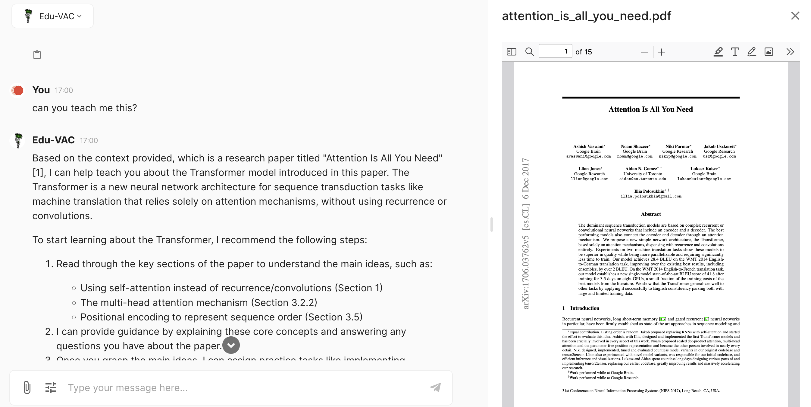

# EduVAC


This VAC is a Langserve app that allows users to interact via a database to learn specific material.  It imports the data or allows users to upload their own files and get the bot to teach them using adaptive learning techniques, tailoring the lesson plan according to the student responses and previous experience.

Its code is open-source here: https://github.com/sunholo-data/vacs-public/tree/dev/eduvac



## Summary

This VAC application incorporates the following features:

### A Pydantic typed Question input schema:

```python
class ChatEntry(BaseModel):
    name: str
    content: str

class Question(BaseModel):
    question: str
    chat_history:   Optional[List[ChatEntry]] = []
    source_filters: Optional[List[str]] = []
    private_docs:   Optional[List[str]] = []
    source_filters_and_or: Optional[bool] = False
```

The `sunholo` functions within [`sunholo/agents/langserve.py`](../sunholo/agents/langserve) query this input schema before sending it the payload to make sure it is in the correct format.

### A configurable model 

This allows the developer to set a choice for model to use, e.g. paid users can use a more expensive but smarter model

Using Langserve configurables within sunholo streaming functions such as [`generate_proxy_stream_async()`](../sunholo/streaming) you can configure Langserve attributes on the fly.

```python
config_model = quick_model.configurable_alternatives(
    ConfigurableField(
        id="role",
        name="User Role",
        description=(
            "The user role used to configure which model to use"
        ),
    ),
    eduvac=model,
    ADMIN=model,
    USER=quick_model,
)
```

This is called from the Sunholo clients by adding a `configurable` parameter:

```python
generate = await generate_proxy_stream_async
    **kwargs,
    # langchain configurable dictionary
    configurable={
        # if user role matches vector_name
        "role": app_user.metadata["role"],
        "vector_name": config["name"],
    })
```

### prompt including chat history, summary and pulled in document context

The main GenAI prompt uses these components to keep the conversation history relevant, and inserts the material that has been selected to learn within the client settings.

```python
_inputs = RunnableParallel({
        "metadata": RunnableLambda(get_retriever) | RunnableLambda(format_docs),
        "question": itemgetter("question"),
        "chat_history": RunnableLambda(format_chat_history) | itemgetter("chat_history"),
        "chat_summary": RunnableLambda(format_chat_summary) | summary_branch | itemgetter("chat_summary"),
    })
```

### Retrieve from docstore

The initial implementation uses AlloyDB as its storage backend.  It uses `get_sources_from_docstore_async()`[../sunholo/database/alloydb] to fetch sources based on the `source_filters` and `source_filters_and_or` arguments.  You could replace this with any docstore.

### Prompt management

The prompts themselves are managed by Langfuse, or a back up yaml file using the [`kind: promptConfig`](../config.md) configuration.

### GenAI analytics

The GenAI calls are sent to the [Multivac Langfuse instance](https://langfuse.sunholo.com) using the callback function provided via [add_langfuse_tracing()](../sunholo/langfuse/callback)


## Config yaml

An explanation of the configuration is below:

* `vac.eduvac` - this is the key that all other configurations are derived from, referred to as "vector_name"
* `llm`: The configuration specifies an LLM model.  You can swap this for any model supported by `sunholo` so that it can work with the [`get_llm()`](../sunholo/components/llm) function via `model = get_llm("eduvac")`.
* `agent`: Required to specify what type of agent this VAC is, which determines which Cloud Run or other runtime is queried via the endpoints.  This agent is derived from Langserve.
* `agent_type`: If the agent is not the same as the `agent_type` then it is specified here to get the correct routing.
* `display_name`: Used by end clients such as the webapp for the UI.
* `avatar_url`: Used by end clients such as the webapp for the UI.
* `description`: Used by end clients such as the webapp for the UI.
* `tags`: Used to specify which users are authorized to see this VAC, defined via `users_config.yaml`
* `upload`: This block determines if the user can upload file mime types and where they end up.  For eduvac this is only available for users with the "eduvac" permission tag.
* `buckets`: Which Google Cloud Storage bucket uploads are available
* `docstore`: Whether the VAC has access to a docstore.  Downloads entire documents after parsing.
* `alloydb`: For Eduvac, alloydb is used for chunking and the docstore.  This configures connection.
* `embedder`: Configurations for embedding after chunking.  In this case it specifies which LLM embedding model will be used.
* `chunker`: Configurations for chunking.  When new documents are added to the bucket or uploaded, they will be automatically chunked according to the settings here.  In this case, semantic chunking is used which uses an LLM to determine what are optimal chunk sizes.


```yaml
kind: vacConfig
apiVersion: v1
vac:
  eduvac:
    llm: anthropic
    model: claude-3-opus-20240229
    agent: eduvac # needs to match cloud run service name
    agent_type: langserve
    display_name: Edu-VAC
    tags: ["eduvac", "free"]
    avatar_url: ../public/eduvac_small.png
    description: "Educate yourself in your own personal documents via guided learning from Eduvac, the ever patient teacher bot.  Use the settings below  to examine and select available syllabus. If you'd like to learn from your own private documents, get in touch at multivac@sunholo.com. "
    upload:  
      mime_types:
        - all
      buckets:
        all: multivac-eduvac-bucket
    buckets:
      raw: multivac-eduvac-bucket
    docstore:
      - alloydb-docstore:
          type: alloydb
    alloydb_config:
      project_id: multivac-alloydb
      region: europe-west1
      cluster: multivac-alloydb-cluster
      instance: primary-instance-1
    embedder:
      llm: openai # if different from llm is what embedding model uses
    chunker:
      type: semantic
      llm: openai
      summarise:
        llm: openai
        model: gpt-3.5-turbo
        threshold: 3000
        model_limit: 30000
```
