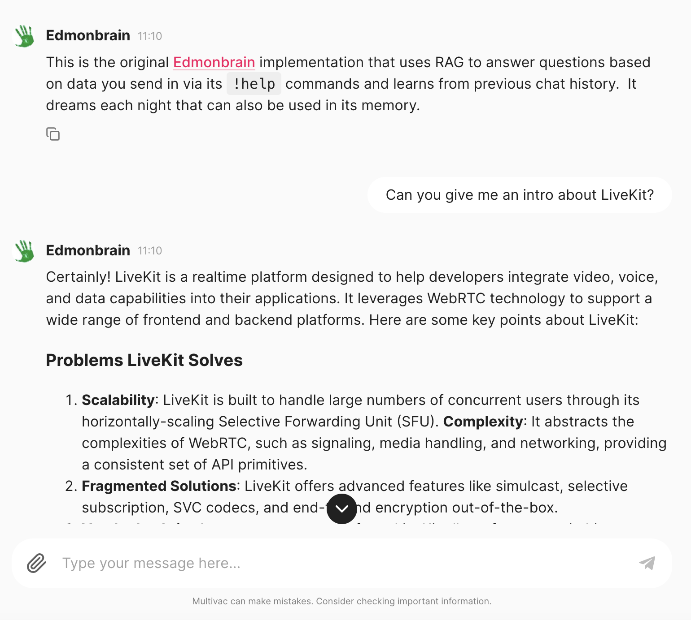

# Embedding Pipelines

The configuration files include sections on what vector store will be used upon retrieval for context in a RAG pipeline.

But to get the documents embedded in the first place is also controlled by the configuration - here is an example from Edmonbrain:

```yaml
kind: vacConfig
apiVersion: v1
  vac:
    edmonbrain: # the vector_name of this VAC
      llm: openai
      agent: edmonbrain
      display_name: Edmonbrain
      avatar_url: https://avatars.githubusercontent.com/u/3155884?s=48&v=4
      description: This is the original [Edmonbrain](https://code.markedmondson.me/running-llms-on-gcp/) implementation that uses RAG to answer questions based on data you send in via its `!help` commands and learns from previous chat history.  It dreams each night that can also be used in its memory.
      model: gpt-4o
      memory_k: 10 # how many memories will be returned in total after relevancy compression
      memory:
        - personal-vectorstore:
            vectorstore: lancedb
            k: 10 #  how many candidate memory will be returned from this vectorstore
        - eduvac-vectorstore:
            vector_name: eduvac # define a different vector_name of another VAC to read from
            read_only: true # can only read, not write embeddings
            vectorstore: lancedb
            k: 3 #  how many candidate memory will be returned from this vectorstore
```

In the above example two memory stores are defined: `personal-vectorstore` and `eduvac-vectorstore`.  Only those without `read_only` will be used when adding documents, but being able to read from other VAC stores means you can set up knowledge sharing and authentication with differing levels of access, such as company wide, department and personal.

## Embedding architecture

Three system VACs are used within most embedding pipelines:

- `chunker` - parses out files and URLS sent to it and turns them into chunks ready for embedding.
- `unstructured` - The `chunker` can send files to this self-hosted unstructured.io servie for document parsing
- `emebedder` - receives chunks from `chunker` and sends them to the appropriate vector store.

Taking advantage of the micro-service architecture means the pipeline can scale from 0 to many GBs per second of embedding.

`vacConfig` can set the attributes of the embedding chunks per VAC, for instance picking the embedding model.

```yaml
    embedder:
      llm: openai # if different from llm is what embedding model uses
```

Some LLM providers don't have embedding (e.g. Anthropic) so you can pick which embedding model can be used.

### Chunker size

```yaml
    chunker:
      chunk_size: 1000
      overlap: 200
```

This lets you determine how big the chunks will be and what overlap they shall have with each other.  This can vary depending on your use case.

### Chunker type: semantic

```yaml
    chunker:
      type: semantic
      llm: openai
      summarise:
        llm: openai
        model: gpt-3.5-turbo
        threshold: 3000
        model_limit: 30000
```

Instead of picking a chunk size you can use the experimental [Langchain technique of semantic chunking](https://python.langchain.com/v0.2/docs/how_to/semantic-chunker/), which will vary the chunk size and cut them off according to similarity scores of each sentence's embedding score.


## Add documents for embedding

### Adding to a bucket

If using Multivac, then embedding is activated when a file hits the designated cloud storage bucket.  A Pub/Sub notification sends the `gs://` URI to the chunker VAC, which then parses and sends to the other embedding services such as `unstructured`, `embedder` and other document stores if configured.

The Pub/Sub is also available to call directly, as well as the individual embedding services, for instance you may already have parsed text content and just want to send it to the `embedder` service.  The overall pipeline is pretty quick, usually only taking under a minute to index big documents such as PDFs and PowerPoints, so it can be used in a live user session.

Often for batch pipelines a feeder bucket is used then an hourly Cloud Storage Transfer service will check the bucket for new files and transfer them across.

The folder of the embedding bucket determines the `VAC` the documents are sent to, so for instance all files that land within `edmonbrain/` are sent to the `edmonbrain` vector stores.

### Adding documents via the UIs

Several of the Multivac clients such as the chat bots, web app or CLI support uploading files directly to the vector store.  Behind the scenes this is uploading the file to the embedding bucket for processing via the bucket pipeline above, or making a direct Pub/Sub call.

Several VACs support special commands to help with this, such as `!saveurl` that will embed a URL after parsing, or `!savethread` to store the current conversation thread as a text file.  For example via the `sunholo CLI`:

```sh
sunholo vac chat edmonbrain
╭────────────────────────────────────── Edmonbrain ──────────────────────────────────────╮
│ This is the original [Edmonbrain](https://code.markedmondson.me/running-llms-on-gcp/)  │
│ implementation that uses RAG to answer questions based on data you send in via its     │
│ `!help` commands and learns from previous chat history.  It dreams each night that can │
│ also be used in its memory.                                                            │
╰─ stream: http://127.0.0.1:8081/vac/streaming/edmonbrain invoke: http://127.0.0.1:8081/─╯
You: !saveurl https://docs.livekit.io/home/get-started/intro-to-livekit/
edmonbrain: URLs sent for processing: 
['https://docs.livekit.io/home/get-started/intro-to-livekit/'] to edmonbrain.
```

The URL contents are then available within ~1min for all clients using that VAC, such as the webapp:



### Using locally via `sunholo embed`

Since the services are available via API, `curl` can also be used to send files to the embedding pipeline, however for convenience its easier to use the `sunholo` cli installed via `pip install sunholo[cli]`.

```sh
usage: sunholo embed [-h] [--embed-override EMBED_OVERRIDE] [--chunk-override CHUNK_OVERRIDE] [--no-proxy] [-m METADATA]
                     [--local-chunks] [--is-file] [--only-chunk]
                     vac_name data

positional arguments:
  vac_name              VAC service to embed the data for
  data                  String content to send for embedding

optional arguments:
  -h, --help            show this help message and exit
  --embed-override EMBED_OVERRIDE
                        Override the embed VAC service URL.
  --chunk-override CHUNK_OVERRIDE
                        Override the chunk VAC service URL.
  --no-proxy            Do not use the proxy and connect directly to the VAC service.
  -m METADATA, --metadata METADATA
                        Metadata to send with the embedding (as JSON string).
  --local-chunks        Whether to process chunks to embed locally, or via the cloud.
  --is-file             Indicate if the data argument is a file path
  --only-chunk          Whether to only parse the document and return the chunks locally, with no embedding
```

See the [`sunholo embed`](../cli/#sunholo-embed) documentation for more information.

## Metadata

TODO
